# respuestas

# Respuestas — Northwind SQL

## Sección 1. Fundamentos: filtrado y agregación

## Pregunta 1 — Catálogo comercial activo

**Enunciado:** Obtén los productos que no están descatalogados y cuyo precio unitario esté entre 10 y 50 euros, ambos incluidos. Muestra el nombre del producto y su precio redondeado a dos decimales, ordenado de mayor a menor precio.

**Columnas esperadas:** `producto`, `precio`

**Consulta:**

```sql
SELECT product_name,ROUND(unit_price::numeric,2)
FROM products
WHERE discontinued = 0 and unit_price between 10 and 50
ORDER BY unit_price desc ;
```

**Resultado:**

> 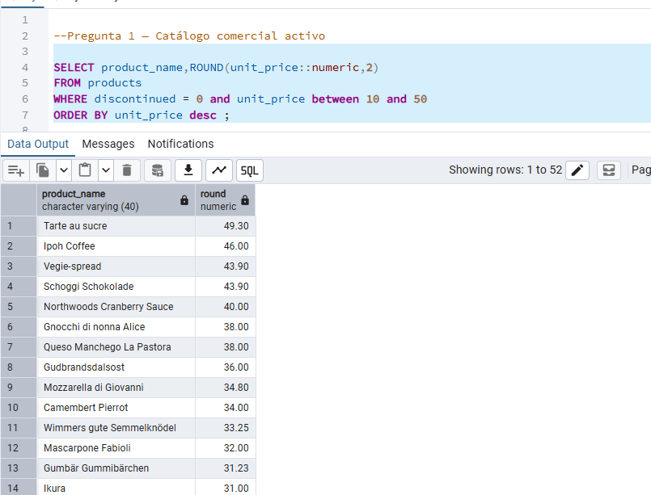

**Técnicas:**

> `WHERE`, `BETWEEN`, `ROUND()`, alias de columna, `ORDER BY`

## Pregunta 2 — Concentración geográfica de la cartera

**Enunciado:** Cuenta cuántos clientes hay en cada país y muestra únicamente aquellos países con 5 o más clientes, ordenados de mayor a menor. Indica también cuántas ciudades distintas hay en cada uno de esos países.

**Columnas esperadas:** `pais`, `num_clientes`, `num_ciudades`

**Consulta:**

```sql
SELECT country as pais, count(customer_id) as num_clientes, count(city) as num_ciudades
FROM customers
group by country
	having count (distinct customer_id) >= 5
```

**Resultado:**

> 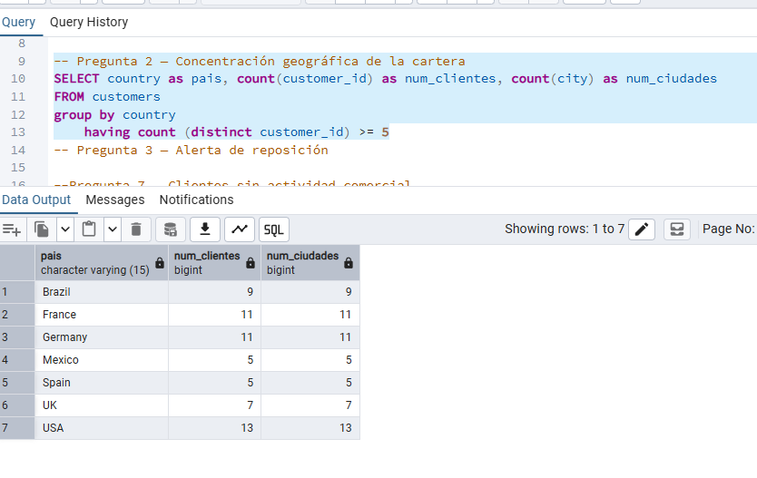

**Técnicas:**

> `GROUP BY`, `COUNT()`, `COUNT(DISTINCT ...)`, `HAVING`

## Pregunta 3 — Alerta de reposición

**Enunciado:** Localiza los productos activos cuyas unidades en stock sean inferiores o iguales a su nivel de reposición. Muestra el nombre, las unidades en stock, el nivel de reposición, las unidades ya pedidas al proveedor y una columna de texto que indique ‘CRÍTICO’ cuando el stock sea 0 y ‘AVISO’ en el resto de casos.

**Columnas esperadas:** `producto`, `stock`, `nivel_reposicion`, `pedido_a_proveedor`, `situacion`

**Consulta:**

```sql
SELECT product_name AS producto,
units_in_stock AS stock,
reorder_level AS nivel_reposicion,
units_on_order AS pedido_a_proveedor,
CASE WHEN units_in_stock = 0 THEN 'CRÍTICO'
	ELSE 'AVISO' END AS situacion
FROM products
WHERE discontinued = 0 AND units_on_order >= units_in_stock
```

**Resultado:**

> 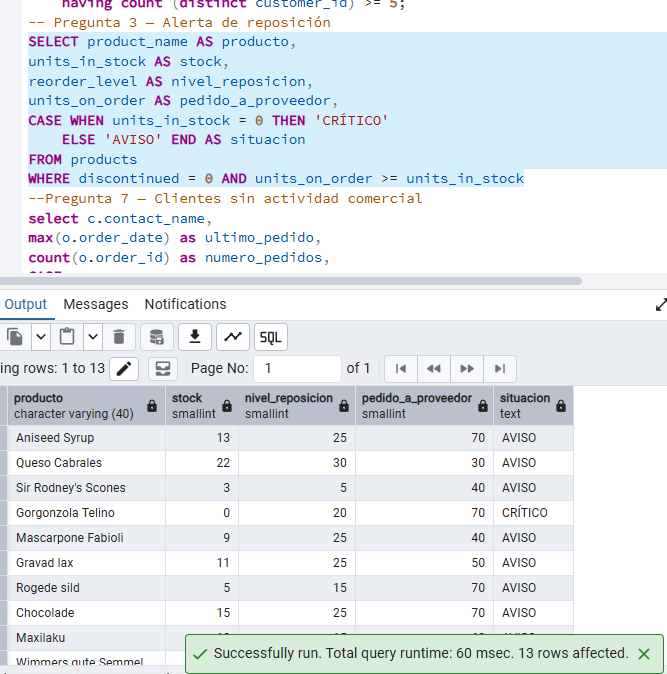

**Técnicas:**

> `WHERE` con comparación entre columnas, `CASE WHEN`

## Sección 2. INNER JOIN

## Pregunta 4 — Ficha completa de producto

**Enunciado:** Para los productos suministrados por empresas de Italia, Francia o España, muestra el nombre del producto, el nombre de la categoría, el nombre del proveedor, su país y su ciudad. Ordena por país y, dentro de cada país, por nombre de producto.

**Columnas esperadas:** `producto`, `categoria`, `proveedor`, `pais`, `ciudad`

**Consulta:**

```sql
SELECT p.product_name AS producto,
c.category_name AS categoria,
s.company_name AS proveedor,
s.country AS pais,
s.city AS ciudad
FROM products p INNER JOIN categories c ON p.category_id = c.category_id
	INNER JOIN suppliers s ON p.supplier_id = s.supplier_id
WHERE s.country IN ('Spain','France','Italy');
```

**Resultado:**

> 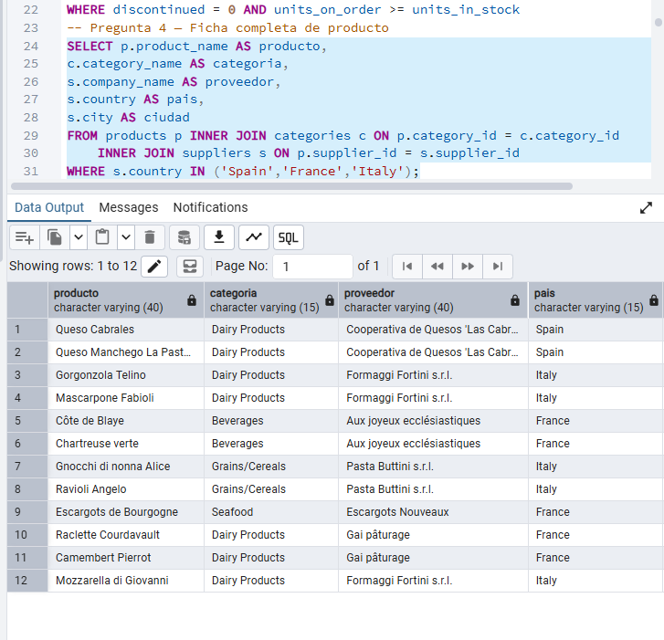

**Técnicas:**

> `INNER JOIN` de tres tablas, alias de tabla, `WHERE ... IN`

## Pregunta 5 — Detalle valorizado de un pedido

**Enunciado:** Muestra, para el pedido 10248, el nombre del producto, el precio unitario aplicado, la cantidad, el descuento y el importe final de cada línea. Añade el nombre del cliente y la fecha del pedido.

**Columnas esperadas:** `cliente`, `fecha_pedido`, `producto`, `precio_unitario`, `cantidad`, `descuento`, `importe_linea`

**Consulta:**

```sql
SELECT
    c.company_name AS cliente,
    o.order_date AS fecha_pedido,
    p.product_name AS producto,
    od.unit_price AS precio_unitario,
    od.quantity AS cantidad,
    od.discount AS descuento,
    ROUND((od.unit_price * od.quantity * (1 - od.discount))::numeric, 2) AS importe_linea
FROM orders o
INNER JOIN customers c USING (customer_id)
INNER JOIN order_details od USING (order_id)
INNER JOIN products p USING (product_id)
WHERE o.order_id = 10248;
```

**Resultado:**

> 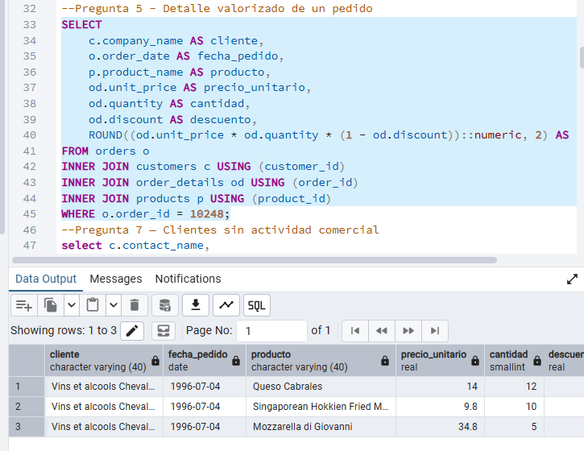

**Técnicas:**

> `INNER JOIN` con `USING`, aritmética entre columnas, `ROUND()`

## Pregunta 6 — Ranking de categorías por facturación

**Enunciado:** Calcula la facturación total de cada categoría durante toda la historia de la compañía. Muestra el nombre de la categoría, el número de líneas de pedido que ha generado, el número de productos distintos vendidos y la facturación total. Incluye únicamente las categorías que superen los 100.000 euros de facturación, ordenadas de mayor a menor.

**Columnas esperadas:** `categoria`, `num_lineas`, `num_productos`, `facturacion`

**Consulta:**

```sql
SELECT
    c.category_name AS categoria,
    COUNT(od.product_id) AS num_lineas,
    COUNT(DISTINCT p.product_id) AS num_productos,
    ROUND(SUM(od.unit_price * od.quantity * (1 - od.discount))::numeric, 2) AS facturacion
FROM categories c
INNER JOIN products p ON c.category_id = p.category_id
INNER JOIN order_details od ON p.product_id = od.product_id
GROUP BY c.category_name
HAVING ROUND(SUM(od.unit_price * od.quantity * (1 - od.discount))::numeric, 2) > 100000
ORDER BY facturacion DESC;
```

**Resultado:**

> 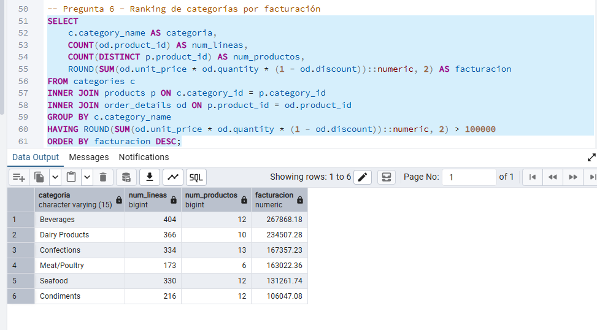

**Técnicas:**

> `INNER JOIN` de tres tablas, `GROUP BY`, `SUM()`, `COUNT(DISTINCT ...)`, `HAVING`, `ROUND()`

## Sección 3. Uniones externas, reflexivas y cruzadas

## Pregunta 7 — Clientes sin actividad comercial

**Enunciado:** Lista todos los clientes con el número de pedidos que ha realizado cada uno y la fecha de su último pedido. Los clientes sin ningún pedido deben aparecer igualmente, con un 0 en el conteo y el texto ‘SIN PEDIDOS’ en lugar de la fecha. Ordena de forma que los clientes inactivos aparezcan primero.

**Columnas esperadas:** `cliente`, `pais`, `num_pedidos`, `ultimo_pedido`

**Consulta:**

```sql

SELECT c.contact_name,
max(o.order_date) AS ultimo_pedido,
count(o.order_id) AS numero_pedidos,
CASE
	WHEN count(o.order_id) = 0 THEN 'SIN PEDIDOS'
	ELSE 'CON PEDIDOS'
END AS texto
FROM customers c LEFT JOIN orders o ON c.customer_id=o.customer_id
GROUP BY c.contact_name

```

**Resultado:**

> 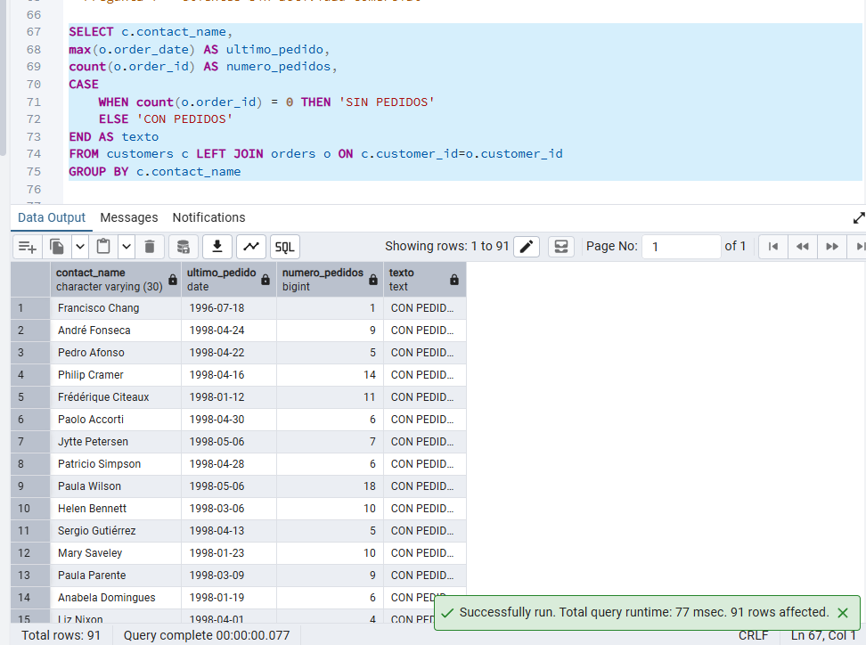

**Técnicas:**

> `LEFT JOIN`, `COUNT()` sobre columna de la tabla derecha, `COALESCE()`, `MAX()`

## Pregunta 8 — Organigrama de la fuerza de ventas

**Enunciado:** Muestra cada empleado con su nombre completo, su cargo, el nombre completo de la persona a la que reporta y el cargo de esa persona. El empleado que no reporta a nadie debe aparecer también, con el texto ‘DIRECCIÓN GENERAL’ en el campo del responsable.

**Columnas esperadas:** `empleado`, `cargo`, `responsable`, `cargo_responsable`

**Consulta:**

```sql
SELECT
    emp.first_name || ' ' || emp.last_name AS empleado,
    emp.title AS cargo,
    COALESCE(jefe.first_name || ' ' || jefe.last_name, 'DIRECCIÓN GENERAL') AS responsable,
    jefe.title AS cargo_responsable
FROM employees emp
LEFT JOIN employees jefe ON emp.reports_to = jefe.employee_id;
```

**Resultado:**

> 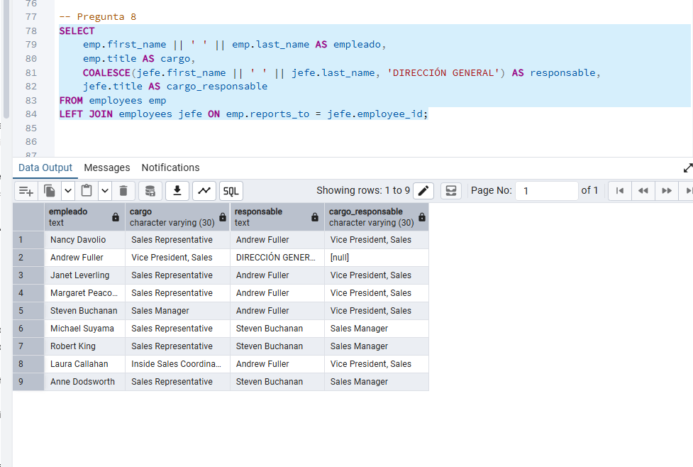

**Técnicas:**

> `SELF JOIN` con `LEFT JOIN`, alias de tabla obligatorios, concatenación de texto, `COALESCE()`

## Pregunta 9 — Rejilla de cobertura categoría × año

**Enunciado:** Genera todas las combinaciones posibles de las 8 categorías con los 3 años del histórico (24 filas) y asocia a cada combinación su facturación, sin huecos: si una categoría no vendió nada en un año concreto, debe aparecer con un 0. Ordena por categoría y año.

**Columnas esperadas:** `categoria`, `anio`, `facturacion`

**Consulta:**

```sql
WITH anios AS (
    SELECT DISTINCT EXTRACT(YEAR FROM order_date) AS anio FROM orders
),
facturacion_real AS (
    SELECT
        p.category_id,
        EXTRACT(YEAR FROM o.order_date) AS anio,
        SUM(od.unit_price * od.quantity * (1 - od.discount)) AS facturacion
    FROM orders o
    JOIN order_details od ON o.order_id = od.order_id
    JOIN products p ON od.product_id = p.product_id
    GROUP BY p.category_id, EXTRACT(YEAR FROM o.order_date)
)
SELECT
    c.category_name AS categoria,
    a.anio AS anio,
    COALESCE(ROUND(f.facturacion::numeric, 2), 0) AS facturacion
FROM categories c
CROSS JOIN anios a
LEFT JOIN facturacion_real f ON c.category_id = f.category_id AND a.anio = f.anio
ORDER BY c.category_name, a.anio;
```

**Resultado:**

> 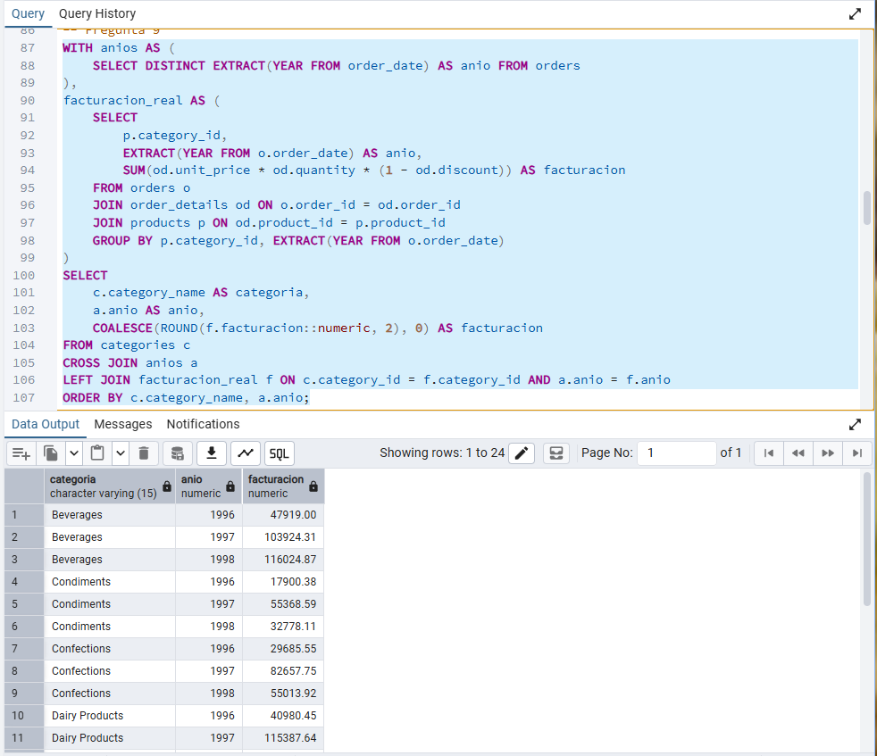

**Técnicas:**

> `CROSS JOIN` para generar la rejilla, `LEFT JOIN` contra los datos reales, `COALESCE()`, `EXTRACT()`

## Pregunta 10 — Mapa de países: clientes frente a proveedores

**Enunciado:** Muestra, para cada país en el que la compañía tiene presencia, cuántos clientes y cuántos proveedores hay. Deben aparecer los países que solo tienen clientes, los que solo tienen proveedores y los que tienen ambos, indicando el tipo de presencia.

**Columnas esperadas:** `pais`, `num_clientes`, `num_proveedores`, `tipo_presencia` (`'SOLO CLIENTES'`, `'SOLO PROVEEDORES'` o `'AMBOS'`)

**Consulta:**

```sql
SELECT
    COALESCE(c.country, s.country) AS pais,
    COALESCE(c.num_clientes, 0) AS num_clientes,
    COALESCE(s.num_proveedores, 0) AS num_proveedores,
    CASE
        WHEN c.num_clientes IS NOT NULL AND s.num_proveedores IS NOT NULL THEN 'AMBOS'
        WHEN c.num_clientes IS NOT NULL THEN 'SOLO CLIENTES'
        ELSE 'SOLO PROVEEDORES'
    END AS tipo_presencia
FROM (
    SELECT country, COUNT(customer_id) AS num_clientes
    FROM customers GROUP BY country
) c
FULL JOIN (
    SELECT country, COUNT(supplier_id) AS num_proveedores
    FROM suppliers GROUP BY country
) s ON c.country = s.country;
```

**Resultado:**

> 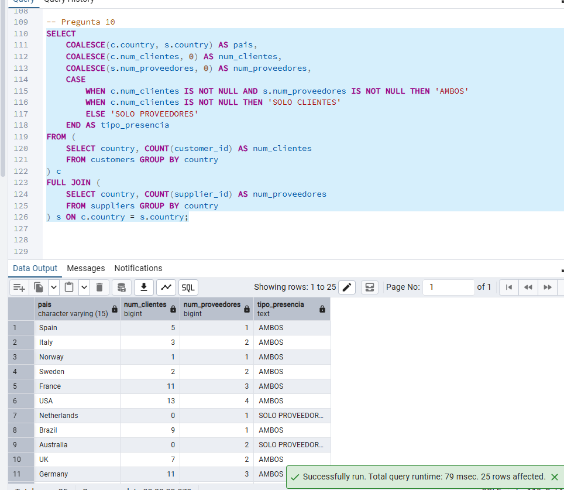

**Técnicas:**

> `FULL JOIN` entre dos subconsultas agregadas, `COALESCE()`, `CASE WHEN`

## Sección 4. Operadores de conjunto

## Pregunta 11 — Directorio unificado de contactos

**Enunciado:** Construye una sola tabla que reúna los contactos de clientes, los de proveedores y los empleados. Cada fila debe indicar el origen (‘CLIENTE’, ‘PROVEEDOR’, ‘EMPLEADO’), el nombre de la persona de contacto en mayúsculas, la organización a la que pertenece, la ciudad y el país. Para los empleados, la organización es el literal ‘NORTHWIND TRADERS’ y el nombre de contacto se forma concatenando nombre y apellidos. Ordena por origen y luego por país.

**Columnas esperadas:** `origen`, `contacto`, `organizacion`, `ciudad`, `pais`

**Consulta:**

```sql
SELECT
    'CLIENTE' AS origen,
    UPPER(contact_name) AS contacto,
    company_name AS organizacion,
    city AS ciudad,
    country AS pais
FROM customers
UNION ALL
SELECT
    'EMPLEADO' AS origen,
    UPPER(first_name || ' ' || last_name) AS contacto,
    'NORTHWIND TRADERS' AS organizacion,
    city AS ciudad,
    country AS pais
FROM employees
UNION ALL
SELECT
    'PROVEEDOR' AS origen,
    UPPER(contact_name) AS contacto,
    company_name AS organizacion,
    city AS ciudad,
    country AS pais
FROM suppliers
ORDER BY origen, pais;
```

**Resultado:**

> 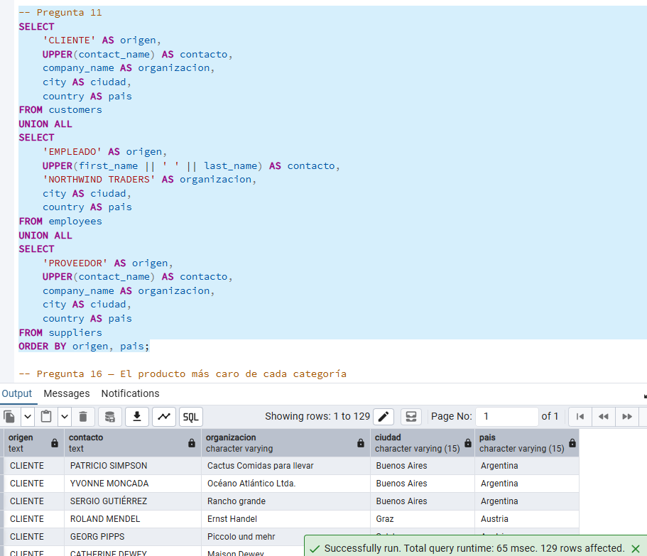

**Técnicas:**

> `UNION ALL`, `UPPER()`, concatenación con `||` o `CONCAT()`, literales como columna

## Pregunta 12 — Mercados con desequilibrio

**Enunciado:** Resuelve en dos consultas independientes: a) países donde hay clientes pero ningún proveedor; b) países donde hay a la vez clientes y proveedores. Ordena ambos resultados alfabéticamente.

**Columnas esperadas:** `pais`

```sql
--Pregunta 12
-- a: No coincidencia
SELECT country AS pais
FROM customers
EXCEPT
SELECT country AS pais
FROM suppliers

-- b: coincidencia
SELECT country AS pais
FROM customers
INTERSECT
SELECT country AS pais
FROM suppliers
```

**Resultado:**

> 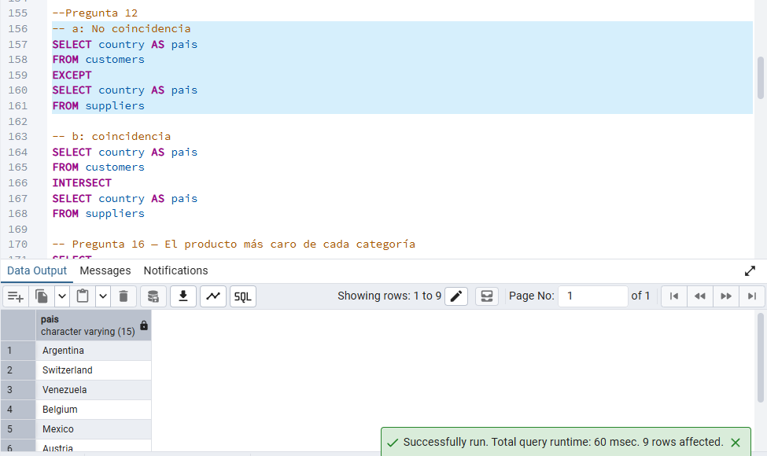
>
> 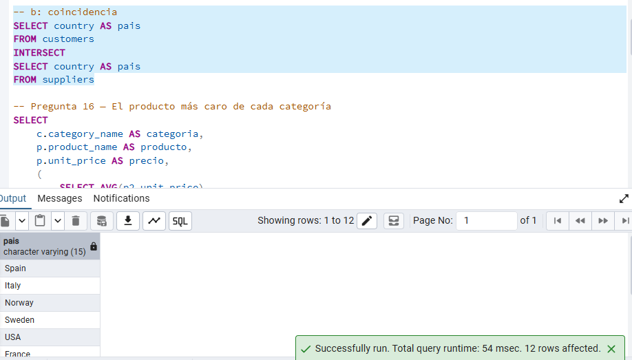

**Técnicas:**

> `2EXCEPT`, `INTERSECT`

## Sección 5. Subconsultas

## Pregunta 13 — Clientes que nunca han comprado pescado

**Enunciado:** Localiza los clientes que nunca han incluido un producto de la categoría ‘Seafood’ en ninguno de sus pedidos. Muestra el nombre del cliente, su país y el número total de pedidos que sí ha realizado, de mayor a menor.

**Columnas esperadas:** `cliente`, `pais`, `pedidos_realizados`

**Consulta:**

```sql
SELECT
    c.company_name AS cliente,
    c.country AS pais,
    COUNT(o.order_id) AS pedidos_realizados
FROM customers c
LEFT JOIN orders o ON c.customer_id = o.customer_id
WHERE NOT EXISTS (
    SELECT 1
    FROM orders o2
    INNER JOIN order_details od ON o2.order_id = od.order_id
    INNER JOIN products p ON od.product_id = p.product_id
    INNER JOIN categories cat ON p.category_id = cat.category_id
    WHERE o2.customer_id = c.customer_id
      AND cat.category_name = 'Seafood'
)
GROUP BY c.company_name, c.country
ORDER BY pedidos_realizados DESC;
```

**Resultado:**

> 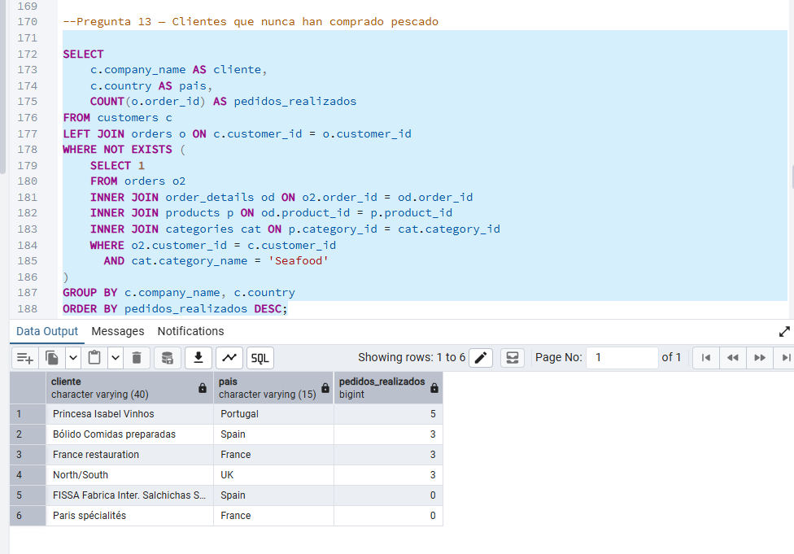

**Técnicas:**

> anti join con `NOT EXISTS`, subconsulta correlacionada, `INNER JOIN` en la subconsulta

## Pregunta 14 — Productos por encima de la media

**Enunciado:** Muestra los productos activos cuyo precio unitario supere el precio medio de todo el catálogo. Incluye en cada fila el precio del producto, el precio medio general y la diferencia entre ambos, todo redondeado a dos decimales. Ordena por diferencia descendente.

**Columnas esperadas:** `producto`, `precio`, `precio_medio_catalogo`, `diferencia`

**Consulta:**

```sql
SELECT
    product_name AS producto,
    ROUND(unit_price::numeric, 2) AS precio,
    ROUND((SELECT AVG(unit_price) FROM products)::numeric, 2) AS precio_medio_catalogo,
    ROUND((unit_price - (SELECT AVG(unit_price) FROM products))::numeric, 2) AS diferencia
FROM products
WHERE discontinued = 0
  AND unit_price > (SELECT AVG(unit_price) FROM products)
ORDER BY diferencia DESC;
```

**Resultado:**

> 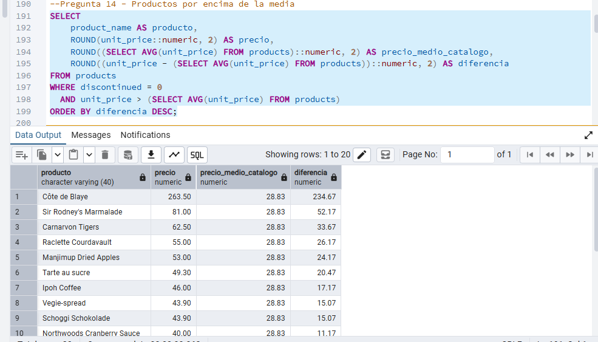

**Técnicas:**

> subconsulta escalar en `WHERE`, subconsulta escalar en `SELECT`, aritmética

## Pregunta 15 — Ticket medio por cliente

**Enunciado:** Calcula, para cada cliente que haya comprado alguna vez, el número de pedidos, el importe total acumulado y el importe medio por pedido. Muestra los 15 clientes con mayor ticket medio. El importe de cada pedido se obtiene sumando sus líneas; el promedio se calcula después, sobre esos importes por pedido, no directamente sobre las líneas.

**Columnas esperadas:** `cliente`, `pais`, `num_pedidos`, `importe_total`, `ticket_medio`

**Consulta:**

```sql
SELECT
    c.company_name AS cliente,
    c.country AS pais,
    COUNT(t.order_id) AS num_pedidos,
    ROUND(SUM(t.importe_pedido)::numeric, 2) AS importe_total,
    ROUND(AVG(t.importe_pedido)::numeric, 2) AS ticket_medio
FROM customers c
INNER JOIN (
    SELECT
        o.customer_id,
        o.order_id,
        SUM(od.unit_price * od.quantity * (1 - od.discount)) AS importe_pedido
    FROM orders o
    INNER JOIN order_details od ON o.order_id = od.order_id
    GROUP BY o.customer_id, o.order_id
) AS t ON c.customer_id = t.customer_id
GROUP BY c.company_name, c.country
ORDER BY ticket_medio DESC
LIMIT 15;
```

**Resultado:**

> 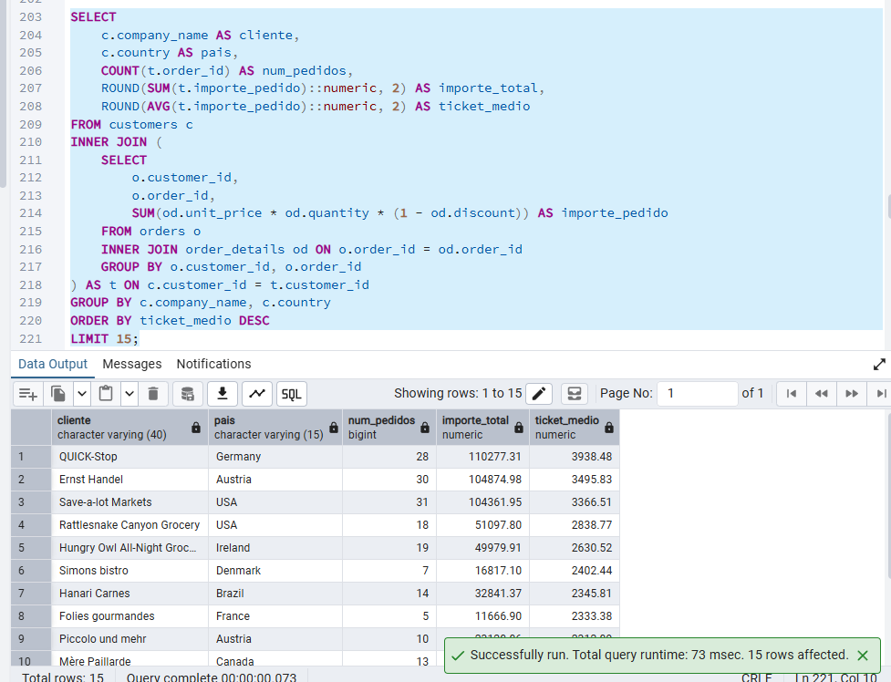

**Técnicas:**

> subconsulta en `FROM` (tabla derivada), agregación en dos niveles, `LIMIT`

## Sección 6. Subconsultas correlacionadas y CTE

## Pregunta 16 — El producto más caro de cada categoría

**Enunciado:** Para cada categoría, muestra el producto con el precio unitario más alto. Incluye el nombre de la categoría, el nombre del producto, su precio y el precio medio de su categoría. Resuélvelo con una subconsulta correlacionada.

**Columnas esperadas:** `categoria`, `producto`, `precio`, `precio_medio_categoria`

**Consulta:**

```sql
SELECT
    c.category_name AS categoria,
    p.product_name AS producto,
    p.unit_price AS precio,
    (
        SELECT AVG(p2.unit_price)
        FROM products p2
        WHERE p2.category_id = p.category_id
    ) AS precio_medio_categoria
FROM products p
JOIN categories c ON p.category_id = c.category_id
WHERE p.unit_price = (
    SELECT MAX(p3.unit_price)
    FROM products p3
    WHERE p3.category_id = p.category_id
);
```

**Resultado:**

> 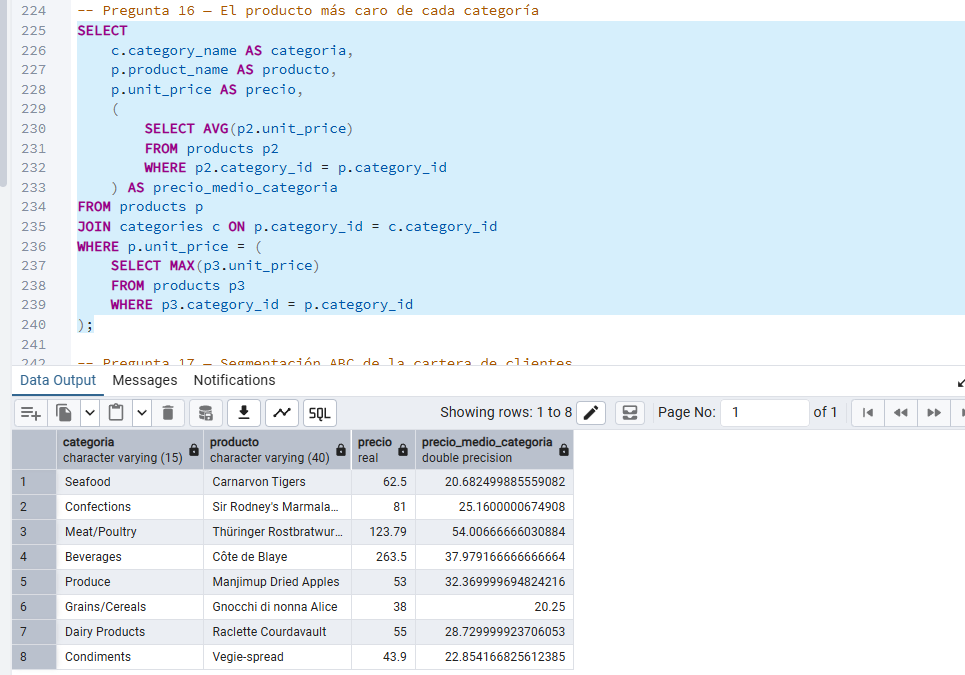

**Técnicas:**

> subconsulta correlacionada en `WHERE`, subconsulta correlacionada en `SELECT`, `INNER JOIN`

## Pregunta 17 — Segmentación ABC de la cartera de clientes

**Enunciado:** Usando CTE, calcula la facturación total de cada cliente, divide los clientes en cuartiles según esa facturación, asigna una etiqueta de segmento (‘A - Estratégico’, ‘B - Consolidado’, ‘C - Ocasional’, ‘D - Marginal’) y devuelve, por segmento, el número de clientes, la facturación total del segmento y el porcentaje que representa sobre el total de la compañía.

**Columnas esperadas:** `segmento`, `num_clientes`, `facturacion_segmento`, `porcentaje_sobre_total`

**Consulta:**

```sql
WITH facturacion_clientes AS (
    SELECT
        customer_id,
        SUM(unit_price * quantity * (1 - discount)) AS facturacion_total
    FROM orders
    JOIN order_details USING (order_id)
    GROUP BY customer_id
),
cuartiles_clientes AS (
    SELECT
        customer_id,
        facturacion_total,
        NTILE(4) OVER (ORDER BY facturacion_total DESC) AS cuartil
    FROM facturacion_clientes
),
segmentos_clientes AS (
    SELECT
        customer_id,
        facturacion_total,
        CASE cuartil
            WHEN 1 THEN 'A - Estratégico'
            WHEN 2 THEN 'B - Consolidado'
            WHEN 3 THEN 'C - Ocasional'
            ELSE 'D - Marginal'
        END AS segmento
    FROM cuartiles_clientes
),
total_compania AS (
    SELECT SUM(facturacion_total) AS total_global FROM facturacion_clientes
)
SELECT
    s.segmento,
    COUNT(s.customer_id) AS num_clientes,
    SUM(s.facturacion_total) AS facturacion_segmento,
    ROUND(SUM(s.facturacion_total::numeric) * 100.0 / tc.total_global::numeric, 2) AS porcentaje_sobre_total
FROM segmentos_clientes s
CROSS JOIN total_compania tc
GROUP BY s.segmento, tc.total_global
ORDER BY s.segmento;
```

**Resultado:**

> 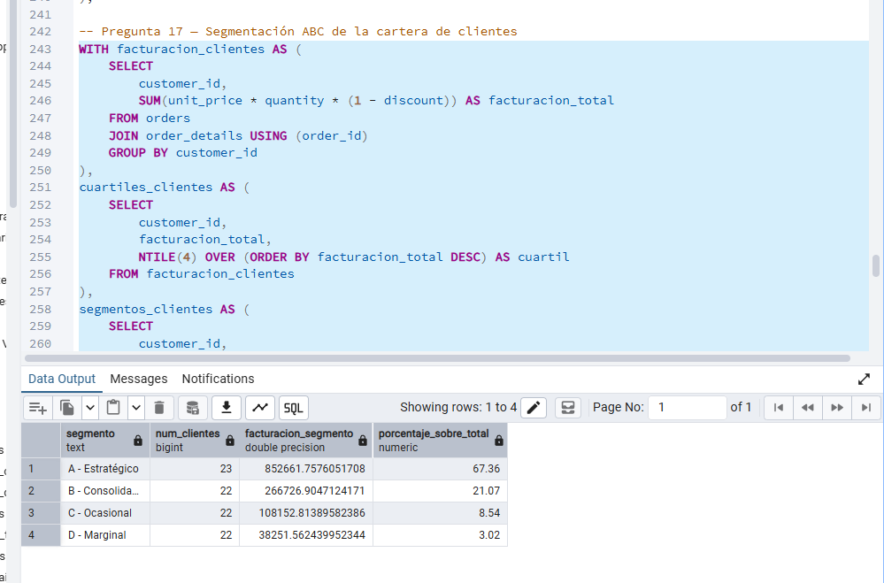

**Técnicas:**

> `WITH` con varias CTE encadenadas, `NTILE()`, `CASE WHEN`, agregación sobre el resultado de una CTE, cálculo de porcentaje

## Sección 7. Funciones de ventana

## Pregunta 18 — Los tres productos más vendidos de cada categoría

**Enunciado:** Para cada categoría, obtén los tres productos con mayor facturación. Muestra la categoría, la posición dentro de la categoría, el nombre del producto, las unidades vendidas y la facturación. Incluye además una columna con la posición global del producto en el conjunto de la compañía.

**Columnas esperadas:** `categoria`, `posicion_en_categoria`, `producto`, `unidades`, `facturacion`, `posicion_global`

**Consulta:**

```sql
WITH ventas_productos AS (
    SELECT
        c.category_name AS categoria,
        p.product_name AS producto,
        SUM(od.quantity) AS unidades,
        SUM(od.unit_price * od.quantity * (1 - od.discount)) AS facturacion
    FROM categories c
    JOIN products p USING (category_id)
    JOIN order_details od USING (product_id)
    GROUP BY c.category_name, p.product_name
),
ranking_productos AS (
    SELECT
        categoria,
        producto,
        unidades,
        facturacion,
        ROW_NUMBER() OVER (PARTITION BY categoria ORDER BY facturacion DESC) AS posicion_en_categoria,
        ROW_NUMBER() OVER (ORDER BY facturacion DESC) AS posicion_global
    FROM ventas_productos
)
SELECT
    categoria,
    posicion_en_categoria,
    producto,
    unidades,
    facturacion,
    posicion_global
FROM ranking_productos
WHERE posicion_en_categoria <= 3;
```

**Resultado:**

> 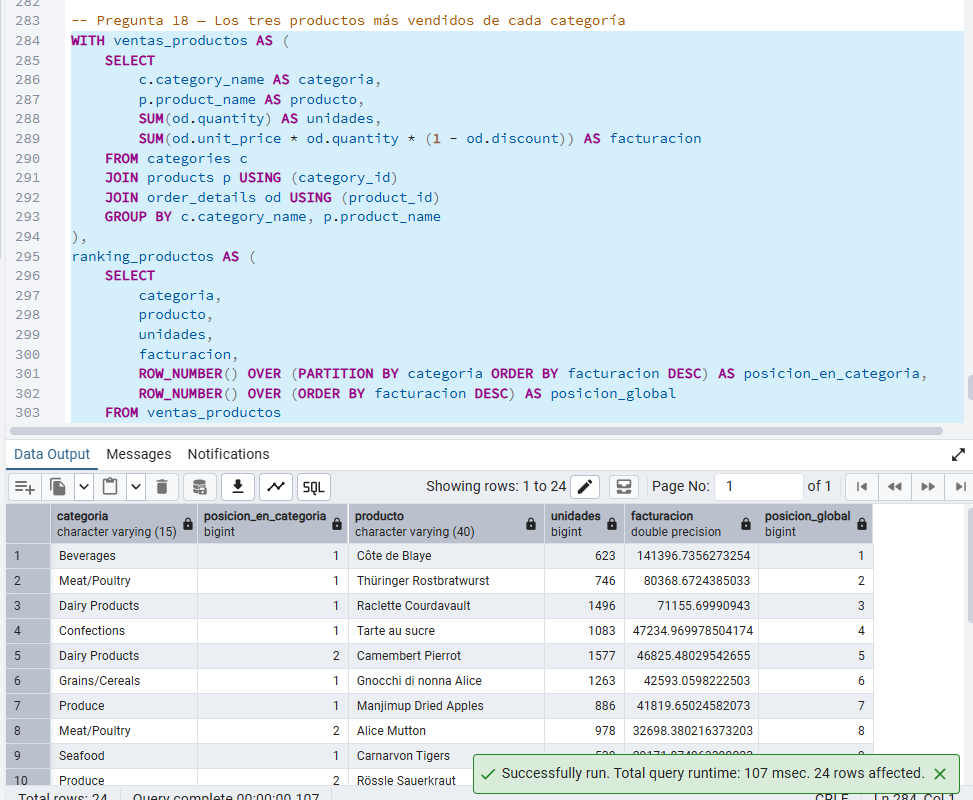

**Técnicas:**

> `RANK()` o `ROW_NUMBER()` con `OVER (PARTITION BY ... ORDER BY ...)`, CTE para poder filtrar por la posición, función de ventana sin `PARTITION BY`

## Pregunta 19 — Evolución mensual con acumulado y media móvil

**Enunciado:** Para cada mes de 1997, calcula: la facturación del mes, el total acumulado desde enero, la media móvil de los tres últimos meses, la facturación del mes anterior y la variación porcentual respecto al mes anterior.

**Columnas esperadas:** `mes`, `facturacion`, `acumulado`, `media_movil_3m`, `mes_anterior`, `variacion_pct`

**Consulta:**

```sql
WITH ventas_mensuales AS (
    SELECT
        DATE_TRUNC('month', order_date)::DATE AS mes,
        SUM(unit_price * quantity * (1 - discount)) AS facturacion
    FROM orders
    JOIN order_details USING (order_id)
    WHERE EXTRACT(YEAR FROM order_date) = 1997
    GROUP BY DATE_TRUNC('month', order_date)
),
calculos_ventana AS (
    SELECT
        mes,
        facturacion,
        SUM(facturacion) OVER (ORDER BY mes) AS acumulado,
        AVG(facturacion) OVER (ORDER BY mes ROWS BETWEEN 2 PRECEDING AND CURRENT ROW) AS media_movil_3m,
        LAG(facturacion, 1) OVER (ORDER BY mes) AS mes_anterior
    FROM ventas_mensuales
)
SELECT
    mes,
    facturacion,
    acumulado,
    media_movil_3m,
    mes_anterior,
    CASE
        WHEN mes_anterior IS NULL OR mes_anterior = 0 THEN NULL
        ELSE ROUND(((facturacion::numeric - mes_anterior::numeric) / mes_anterior::numeric) * 100, 2)
    END AS variacion_pct
FROM calculos_ventana
ORDER BY mes;
```

**Resultado:**

> 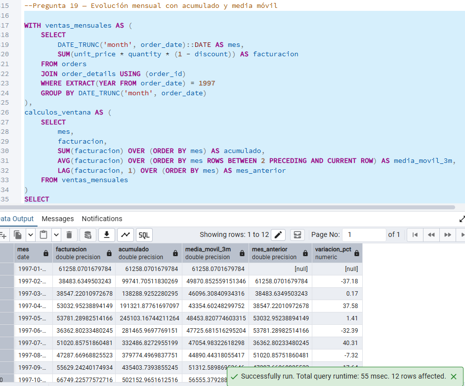

**Técnicas:**

> `DATE_TRUNC()`, `SUM() OVER (ORDER BY ...)` como total acumulado, definición explícita de marco con `ROWS BETWEEN 2 PRECEDING AND CURRENT ROW`, `LAG()`, CTE

## Pregunta 20 — Cuadro de mando anual por categoría

**Enunciado:** Construye una tabla donde cada fila sea una categoría y las columnas muestren la facturación de 1996, 1997 y 1998 en columnas separadas, más el total de los tres años. Añade una fila de totales generales, una columna con el peso de cada categoría sobre la facturación total de la compañía, y otra que muestre si la categoría creció o decreció entre 1997 y 1998.

**Columnas esperadas:** `categoria`, `f_1996`, `f_1997`, `f_1998`, `total`, `peso_pct`, `tendencia`

**Consulta:**

```sql
WITH pivot_anual AS (
    SELECT
        COALESCE(c.category_name, 'TOTAL GENERAL') AS categoria,
        SUM(od.unit_price * od.quantity * (1 - od.discount)) FILTER (WHERE EXTRACT(YEAR FROM o.order_date) = 1996) AS f_1996,
        SUM(od.unit_price * od.quantity * (1 - od.discount)) FILTER (WHERE EXTRACT(YEAR FROM o.order_date) = 1997) AS f_1997,
        SUM(od.unit_price * od.quantity * (1 - od.discount)) FILTER (WHERE EXTRACT(YEAR FROM o.order_date) = 1998) AS f_1998,
        SUM(od.unit_price * od.quantity * (1 - od.discount)) AS total
    FROM categories c
    JOIN products p ON c.category_id = p.category_id
    JOIN order_details od ON p.product_id = od.product_id
    JOIN orders o ON od.order_id = o.order_id
    GROUP BY ROLLUP(c.category_name)
)
SELECT
    categoria,
    COALESCE(ROUND(f_1996::numeric, 2), 0) AS f_1996,
    COALESCE(ROUND(f_1997::numeric, 2), 0) AS f_1997,
    COALESCE(ROUND(f_1998::numeric, 2), 0) AS f_1998,
    ROUND(total::numeric, 2) AS total,
    ROUND((total / MAX(total) OVER () * 100)::numeric, 2) AS peso_pct,
    CASE
        WHEN categoria = 'TOTAL GENERAL' THEN NULL
        WHEN f_1998 > f_1997 THEN 'CRECIMIENTO'
        WHEN f_1998 < f_1997 THEN 'DECRECIMIENTO'
        ELSE 'MANTENIDO'
    END AS tendencia
    /* Nota: La tendencia entre 1997 y 1998 no es del todo representativa ni
       directamente comparable, ya que los datos de 1998 finalizan en el mes de mayo. */
FROM pivot_anual
ORDER BY
    CASE WHEN categoria = 'TOTAL GENERAL' THEN 1 ELSE 0 END,
    total DESC;
```

**Resultado:**

> 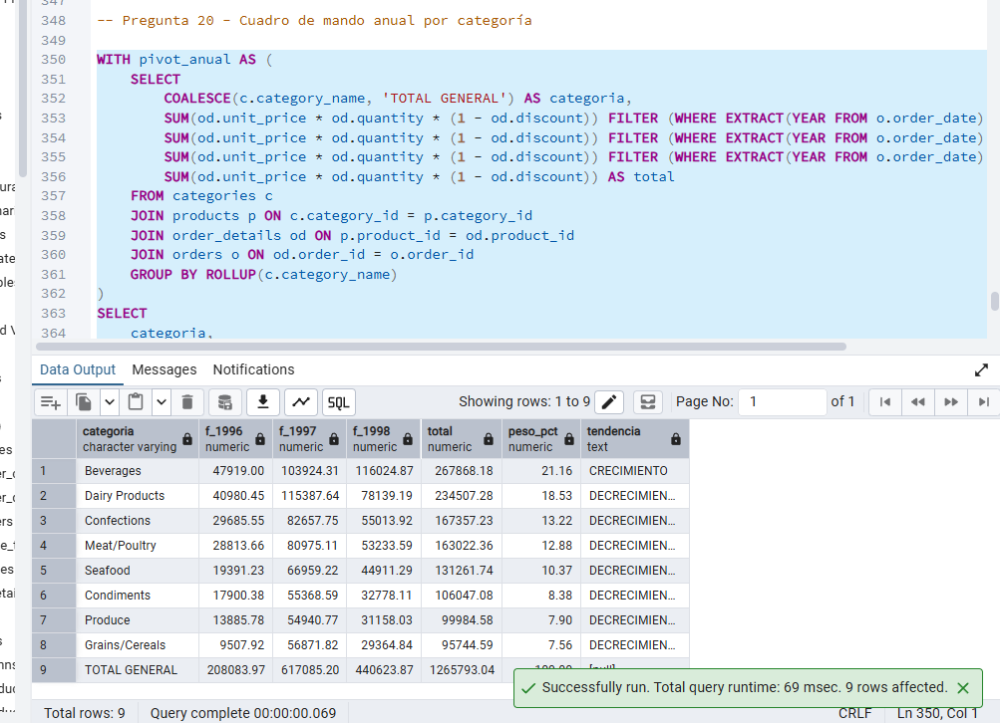

**Técnicas:**

> **Técnicas:** pivotado manual con `CASE WHEN` dentro de `SUM()` (o `FILTER`), `ROLLUP` para la fila de totales, `COALESCE()`, `CASE WHEN` para la tendencia, funciones de ventana para el peso
